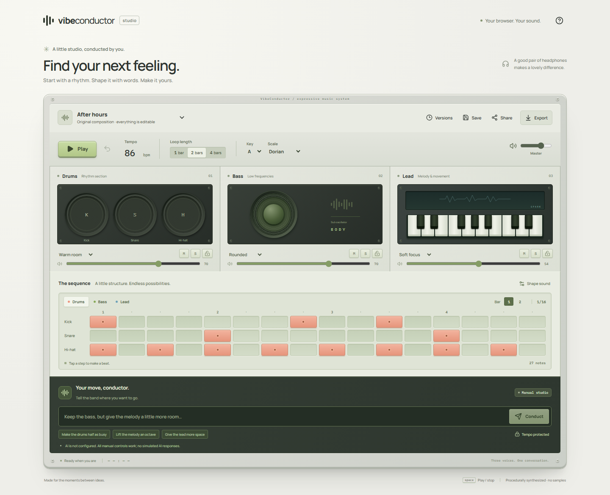

# VibeConductor

A browser instrument for shaping three musical voices with notes, physical controls, and ordinary language. The console pairs a tactile aluminum-and-graphite surface with a precise step sequencer. Sound is synthesized locally with Web Audio; no recording or microphone access is needed.



## Play locally

Use Node.js 24 or later. From the project directory:

```sh
npm ci
npm run dev
```

Open [127.0.0.1:4310](http://127.0.0.1:4310), choose an original sketch, and press **Play**. A user gesture starts browser audio. In the default local mode, the server binds only to the loopback interface and saves to `data/vibeconductor.sqlite`.

The OpenAI key is intentionally unconfigured. The sequencer, instruments, playback, undo, saving, JSON exchange and WAV export work without it. Conducting reports that AI is unavailable; it never substitutes a canned response. For an owner who later chooses to enable live AI, the server reads `OPENAI_API_KEY` from the environment or an ignored `.env` file. Keep keys out of the browser and source control. See [.env.example](.env.example) and [the API guide](docs/api.md).

## The instrument

- Three original starting compositions, plus a blank canvas; drums, bass and lead each have three original synthesized presets.
- A drum step grid and melodic piano rolls with note duration, velocity, mute, solo, volume, brightness and decay controls.
- One, two or four bars in 4/4, 60–160 BPM, with a key/scale guide. Changing the guide does not transpose existing notes.
- A visible draft and loop-boundary playback updates. Undo cancels the whole unheard batch first; Stop cancels old sources and resets playback. Hiding the tab stops sound safely.
- Sound-triggered drum, speaker and key animation, reduced-motion support, keyboard editing, and responsive layout.
- Browser draft recovery, version comparison/restoration, private SQLite saves, validated JSON import/export, and stereo WAV export.
- Explicit immutable snapshot links. Visitors press Play to listen; later edits to the private composition do not change the shared score. Localhost links are only reachable on the same computer.
- Optional real AI editing through the OpenAI Responses API: protected tracks, tempo lock and bar scope, revision checks, strict output validation, cancellation and usage reporting.

The score remains inspectable throughout. Accepted AI edits are explanations plus bounded note/parameter operations. Both server and browser validate them before they can affect music.

## Development and verification

| Command                           | Purpose                                                            |
| --------------------------------- | ------------------------------------------------------------------ |
| `npm run dev`                     | Express + Vite at port 4310                                        |
| `npm run check`                   | Type checking, unit/server tests, production browser build         |
| `npm run test:watch`              | Watch unit tests                                                   |
| `npx playwright install chromium` | Install the browser used by end-to-end tests                       |
| `npm run test:e2e`                | Build the frontend, then run isolated Chromium checks on port 4321 |
| `npm run eval`                    | Eight offline constraint checks; no paid calls                     |
| `npm run build`                   | Type check and build `dist`                                        |
| `npm run preview`                 | Serve the existing `dist` locally under normal local access rules  |
| `npm start`                       | Production server; requires owner secrets and an HTTPS origin      |

Run `npm run build` before `npm run preview`. Preview serves the optimized browser bundle without Vite's development middleware; it defaults to loopback-only local access. Setting `NODE_ENV=production` or passing `--production` still requires the production password, session secret and HTTPS origin, even if `--preview` is present.

CI runs the same checks without any API credential and retains its evaluation/browser artifacts. Browser tests exercise the optimized frontend with local server access rules. The mocked AI tests establish validation and failure handling, not live model quality. Live model evaluation is deliberately opt-in; its status and limitations are described in [docs/evaluation.md](docs/evaluation.md).

The app uses React/TypeScript, Express, Zod, Node's built-in SQLite, and direct Web Audio. The score schema and pure editing functions are shared between client and server. There are no accounts, collaboration service, sample downloads or background generation jobs.

## Hosting and design references

[Deployment instructions](docs/deployment.md) provide a Docker image, persistent database volume and HTTPS reverse-proxy recipe. Production requires a password and session secret. This repository does not publish a live deployment automatically.

The visual direction draws on [Roland50 Studio](https://roland50.studio/) for instrument grouping, [Moog Mariana](https://software.moogmusic.com/store/mariana) for dimensional controls, the [OP–1 field](https://teenage.engineering/products/op-1) for industrial restraint, and [Ableton Learning Music](https://learningmusic.ableton.com/the-playground.html) for clear editing. VibeConductor's surfaces, SVG instruments, music and synthesis are original; no product imagery or third-party audio clips are bundled. Manrope and IBM Plex Mono are bundled through their font packages; their upstream license files are copied into [public/licenses](public/licenses/).

Further detail: [implementation plan](docs/implementation-plan.md), [design references](docs/design-references.md), [architecture](docs/architecture.md), [score schema](docs/score-schema.md), [API and security model](docs/api.md), [evaluation](docs/evaluation.md), [verification record](docs/verification.md), [case study](docs/case-study.md), [demo script](docs/demo-script.md), [deployment](docs/deployment.md).
