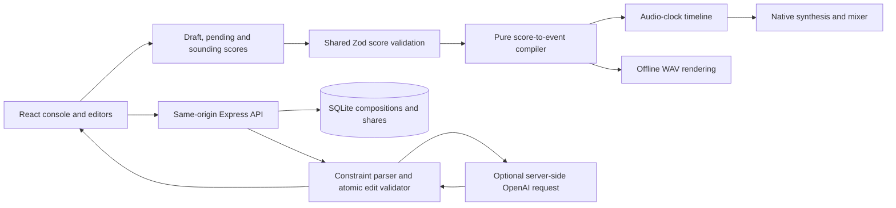

# Architecture

VibeConductor is a single-owner browser instrument built with React, TypeScript, Vite, Express, Node's SQLite driver and native Web Audio. Three original starting compositions and all nine synthesis presets are local source code. The manual instrument does not depend on an AI account, network model response or commercial audio sample.

## Components and data flow

The browser owns interactive composition state and Web Audio resources. The server owns authentication, persistence, immutable sharing, provider credentials and request limits. `shared/score.ts` and `shared/edits.ts` define validation and editing rules used on both sides. React never evaluates model-supplied code.

The server serves the Vite application through development middleware or built production files. Public snapshot pages use the same browser application at `/s/:id`, fetch only their immutable score, disable composition editing and wait for an explicit Play gesture. Private authoring endpoints require the owner session. The application contains no multi-user account model.

## Audio scheduling and transitions

`AudioTimeline` is a pure scheduling coordinator. It compiles immutable loop snapshots, assigns each loop a monotonically increasing ID and advances an event cursor so an occurrence is scheduled once. The browser `AudioEngine` polls it every 25 ms with a 100 ms scheduling horizon measured against `AudioContext.currentTime`. Playback starts approximately 50 ms in the future. React updates and animation frames never drive note timing.

Ordinary score edits update the draft immediately. While stopped, the draft is ready for the next Play. While playing, a candidate score replaces the current unscheduled candidate and enters the next loop boundary whose scheduling has not begun. A loop already inside the lookahead window retains its frozen score, tempo and length; a later edit targets the following boundary. The UI exposes the pending revision and time until it is due.

The session separately tracks:

- **Draft:** the latest accepted editable score.
- **Pending:** the latest draft still waiting to become audible.
- **Sounding:** the revision used by the current loop.
- **History:** accepted versions and their labels/directions, plus the prefix that has become committed for playback.

Each accepted mutation receives a fresh revision ID. A queued batch can contain several accepted edits. Undo first cancels that unheard batch and restores the sounding music with a fresh identity. This is an explicit exception to ordinary loop freezing: future native sources, including ones already scheduled inside the lookahead, are stopped before their onset, removed from the visual queue and replaced with the prior music. Undo of an already audible revision is an ordinary pending transition.

Volume, mute and solo travel through immediate ramped track mixer gates. Master volume/mute have a separate final gain. They never rewrite scheduled note envelopes. Stop invalidates pending starts, stops future sources, briefly releases active voices, clears timers/visual events and resets the transport. The next Play starts the latest draft from step zero. Native source ownership is retained until `onended`, when associated nodes are disconnected.

The synthesis graph is track voices → track gains → transport gate → master/headroom → compressor → destination. Kick uses an oscillator pitch drop; snare combines filtered seeded noise and a tonal component; hi-hat uses filtered noise. Bass and lead use oscillators, filters and short envelopes. Presets select waveform/shape choices, with persisted brightness and decay controls. Sustains end by the loop end; very short release crossfades avoid hard discontinuities.

Instrument animation consumes scheduled note events only after the audio clock reaches their onset, with current mute/solo/master gates respected. Animation is a visual follower and may lag under rendering load without moving musical events. The playhead notifies React only when the integer step changes, avoiding a full studio render on every animation frame. Dialogs dim the studio without blurring the moving instrument surface.

## Editing, recovery and conducting

The drum editor toggles kick/snare/hat steps. The melodic editor adds notes, selects their span, and exposes start, duration and velocity controls. It preserves monophony by replacing overlapping melodic notes; runtime validation remains the final boundary. Key and scale shade the grid and guide composition without transposing existing notes. Version comparison is visual: current music keeps playing until a version is explicitly restored.

The browser debounces draft recovery into local storage. Version history is kept in memory; the newest 30 versions accompany recovered/saved compositions. SQLite stores complete score snapshots and history as JSON, so save/reload never calls a model. Sharing writes a separate immutable score snapshot under an unpredictable token. Editing or saving the authoring composition cannot change that snapshot. JSON import validates every musical field and creates a new composition identity.

Typed conducting sends the exact draft and its revision, a fresh request ID, the user's direction and explicit UI constraints. The server independently parses supported hard constraints, calls the configured OpenAI Responses API using a strict structured-output schema, then applies the complete proposal to a copy through the shared domain validator. A response contains operations, a concise explanation and usage diagnostics; it does not persist a composition automatically.

The client checks both request identity and its local revision/generation before accepting a response, then validates the proposal again. Manual edits, undo and a newer request prevent an old result from overwriting new work. Request cancellation is separate from playback. The server permits one in-flight model call per session, imposes a 20-second deadline and disables SDK retries. Completed outcomes, including failures, are cached by session/request ID for 15 minutes; reusing an ID with changed content is rejected. The cache is in memory and does not survive process restarts.

AI credentials are intentionally optional. With no key, the backend reports AI unavailable and the UI labels the working manual studio honestly. Live evaluation requires separately configured credentials; mocked responses are never presented as generated music. [Evaluation documentation](evaluation.md) describes the held-out cases and reporting limitations.

## Persistence and service interfaces

| Interface                                                               | Responsibility                                                            |
| ----------------------------------------------------------------------- | ------------------------------------------------------------------------- |
| `GET /api/session`, `POST /api/login`, `POST /api/logout`               | Owner access and AI availability.                                         |
| `GET/POST /api/compositions`, `GET/PUT /api/compositions/:id`           | Private saved compositions and bounded version history.                   |
| `POST /api/shares`, `GET /api/shares/:id`                               | Create an immutable snapshot; read it without author credentials.         |
| `POST /api/conduct`                                                     | Validate, propose and independently check structured musical edits.       |
| `compileScore`, `applyProposal`, `parseScore`                           | Shared domain boundaries for UI, server, playback and export.             |
| `AudioEngine.start/stop/queue/cancelPending/setMixer/setMaster/dispose` | Browser resource ownership and transport integration.                     |
| `exportWav(score, loops)`                                               | Offline rendering through the same compiler, instruments and track gates. |

See [API reference](api.md) for complete shapes and errors, and [score schema](score-schema.md) for invariants. Unsupported schema/synthesis versions are rejected rather than guessed or migrated silently.

WAV export renders four loops from the current draft by default at 44.1 kHz, stereo, 16-bit PCM. It includes persisted track settings and mute/solo, and uses fixed default master headroom rather than the browser's temporary listening volume. This is composition rendering, not recording of a live session or timed edit history.

Password-free development binds to an actual loopback address and verifies both connection origin and allowed Host values. Deployed owner mode requires a long password, session secret and HTTPS origin. Sessions use signed, revocable, HttpOnly, SameSite cookies; production cookies are Secure. Mutation endpoints require same-origin checks, JSON and an application request header. Request sizes and rates are bounded, diagnostics avoid private prompts and credentials, and the development file server blocks environment files, server files and SQLite files.

## Boundaries and verification

This is a single-process application with local SQLite and in-memory sessions, rate limits and request idempotency. Horizontal scaling would require shared coordination and a deployment/storage design. Immutable links are publicly readable by anyone holding the token; they contain the composition score, not the author's history or secrets.

Native Web Audio provides an audio clock, but the JavaScript scheduler still needs execution time. A delayed timer during a rest can continue when no note deadline was missed. If an unscheduled onset is more than 35 ms late, or an entire incoming loop was missed, playback stops with a recoverable notice instead of emitting late bursts or performing unbounded catch-up. Hidden tabs and interrupted/suspended contexts also stop safely and require Play to restart. The application does not promise background performance, sample-identical DSP across browsers, or a live-performance recording facility.

Unit tests cover symbolic score rules, atomic constraints, revision transitions, simulated scheduling boundaries, source ownership and WAV encoding. Server tests use SQLite and controlled provider implementations to exercise access and request failures. Browser checks and offline renders cover different evidence: an automated render can establish valid/non-silent samples, but pleasant balance and subjective musical intent require listening. Test outcomes and live-versus-mocked evaluation should be reported explicitly rather than inferred from schema validity.
